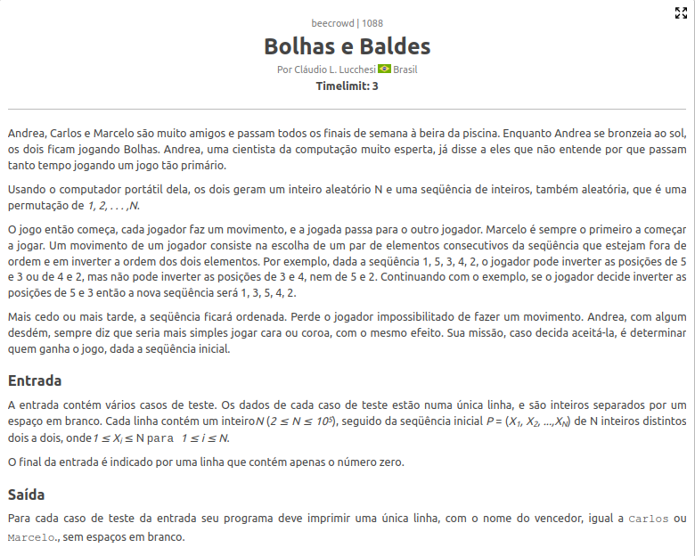
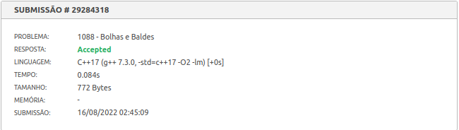
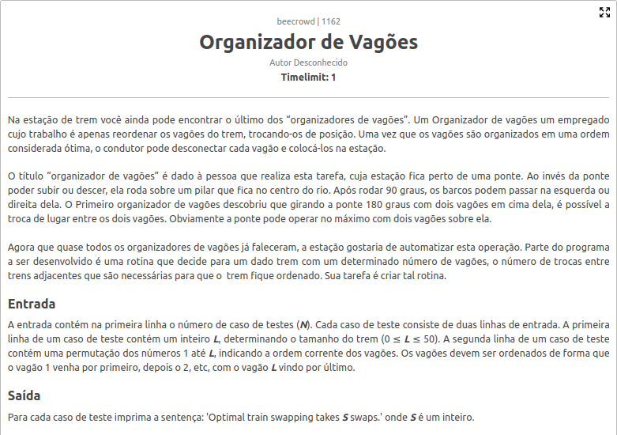
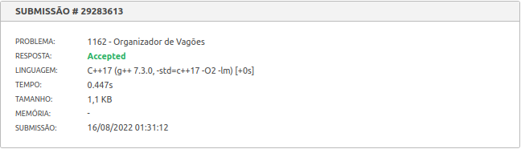

# Exercícios Resolvidos

**Conteúdo da Disciplina**: D&C 

## Alunos
|Matrícula | Aluno |
| -- | -- |
| 180149598  |  Victor Hugo SIqueira Costa |
| 180029240  |  Wesley Pedrosa dos Santos |

## Sobre 
Solução de exercícios sobre Dividir e Conquistar pela dupla 12 (Victor Hugo, Wesley Santos). Para resolver os exercícios foi utilizada a plataforma **beecrowd**.

## Screenshots
[Bolhas e Baldes](https://www.beecrowd.com.br/judge/pt/problems/view/1088) 
 
 

[Organizador de Vagões](https://www.beecrowd.com.br/judge/pt/problems/view/1162) 
 
 

## Instalação e Uso
**Linguagem**: C++ 
Para testar os códigos e conseguir os *aceppted* basta ir no link de cada um dos exercícios e submeter o respectivo código para a plataforma poder avaliar 
